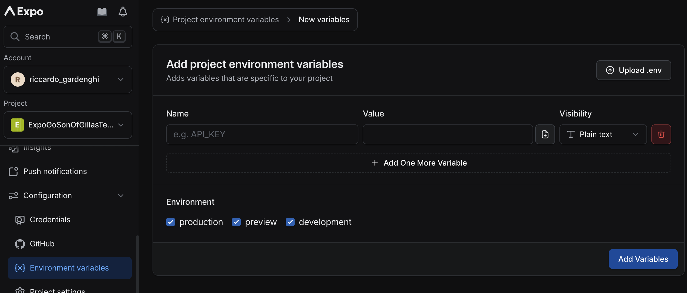

# Welcome to ExpoGO SonOfGillas Template 
the aim of this repository is to create an handfull template for new React Native Projects.
In Particular the project use expo go and it's Countinuous Native Generation

# Software Needed
AndoridStudio Or Xcode \
Node.js v20.18.1 \
react-native v0.78.1 \
expo-sdk  v52.0.39 \
eas-cli v16.0.1

## Env Management and Setup
1. you need to create an account at https://expo.dev/ 
2. get access to the project or create one in https://expo.dev/ 
    
3. Open the project in https://expo.dev/ and set this values in app.config.ts:\
   Set EAS_PROJECT_ID to your Expo project ID.\
   Set PROJECT_SLUG to your project slug.\
   Set OWNER to your Expo account name.\
   
4. In the app.config.ts upadate: \
   the APP_NAME,\
   the PACKAGE_NAME,\
   the BUNDLE_IDENTIFIER, \
   and the SCHEMA (only if you need deeplinking)
5. in the /assets/images/icons update the icons
6. in your https://expo.dev/ open your projet and in the configuration tab open
   the "Environment variables" section
   
7. Here you can create your variables, each variable have a Name a Environment and a Value. 
   The name of each variable must have EXPO_PUBLIC as prefix, for exemple:
   ```
      EXPO_PUBLIC_API_URL
   ```
   you will be able to access the variable in this way
   ```typescript
      process.env.EXPO_PUBLIC_API_URL
   ```
   Remember to create the variable for each enviroment if they are different.
8. Install eas and log in with you expo account
      ```bash
         yarn add eas-cli
      ```
      ```bash
          eas login
      ```
9. every time you update the env variable you must pull the .env.local file with the command:
   ```bash
      eas env:pull
   ```


## Get started
1. setup the env following the "Env Management and Setup" section

2. Install dependencies
   ```bash
   yarn install
   ```

3. Enable your physical device debug-usb (https://reactnative.dev/docs/running-on-device) \
   OR \
   Open an Emulator (with AndoridStudio or Xcode)

4. Generate a Android and Ios Foulders
   ```bash
   npx expo prebuild
   ```
5. build your app. (If you did the "Env Management and Setup" section, the 
   build command will atomatically get the env prom expo.dev project during the eas build)
   ```bash
      #Build for android
      yarn build:android:dev
      #Build for ios
      yarn build:ios:dev
   ```
   if you want to create a SIMULATOR ONLY build without android keystore or apple account login
   ```bash
      #Build for android no keystore needed
      yarn build:android:debug
      #Build for ios no login needed
      yarn build:ios:debug
   ```
6. Intall the build 
   ```bash
      adb install /Path/to/your/Build/development.apk ??
   ```
7. Connect your Device and your Pc to the same Wifi 
   (Wifi repaters don't count as same wifi. due to different ip mapping between moden and repaters)
8. Start the local development server
   ```bash
   npx expo start
   ```
9. The expo start log should have print your IP and a PORT, this is where the development server is hosted. 
If you can't find then the port should always be 8081, and your ip can be find with this command
   ```bash
      #Get MacOs Ip
      ifconfig | grep "inet 192.168"
   ```
10. open the app installed with the step 6 and insert in the serber usl text field
   ```
      http://<your-ip>:8081
   ```


## Project structure 📁
The project is structured following a feature-first approach

```
├── app
│   ├── shared
│   ├─── features
│   │    ├──── login
│   │    ├──── onboarding
```

The folder `/app` contains the following subfolders:
- features: contains a subfolder for each of the features that logically compose the application
- shared: contains all the classes, constants and functions shared between multiple features

## Feature structure  📁

```
├── login
│   ├─── data_model
│   ├─── logic
│   ├─── presentation
```

Each feature is divided into 3 further subfolders:
- data_model: 
    It containts all the interfaces and the functions to define the entities and to manipulate the data need from the feauture
- logic: 
    It containes a Redux slice to manage all the business logic of the feature, and the reducers to interact with the UI
- presentation: 
    it contains all the pages, and components for the feature Ui rendering

### Data layer
```
├── data_model ❌
│   ├─── entities
│   ├─── data_sources
│   │    ├─── data_sources_interface.ts
│   │    ├─── data_sources_iml_1.ts
│   │    ├─── data_sources_iml_2.ts
│   ├─── repositories
│   │    ├─── repository_interface.ts
│   │    ├─── repository_iml.ts
```
- Entities: The entities are the domain model used only by the current features. The shared ones will be located inside the shared folder
- Data sources:
    Components that provide functionalities to retrieve, edit and store data. Sources can provide access to remote, local or in-memory data. This is the layer where actual integration with the APIs is implemented. It's important to separate interface and implementation. 
- Repositories:
    Components that expose a common interface and implementation to abstuct the data_sources and let the higher layers to access data in a impler way. They also mediate between different sources and implement caching strategies.

❌ NOTE: if the app it is small, it is better to have only the data_model in the shared foulder

### Logic layer

- TODO

### Presentation layer
```
├── presentation
│   ├─── styles
│   ├─── components
│   ├─── page_1
│   │   ├─── style.tsx
│   │   ├─── page_1.tsx
│   ├─── page_2
```
- Styles:
    Foulder for the stylesheets for this feature. All the common stylesheets should be in the shared foulder
- Components:
    All the grafic widget specific for this feature. All the common Components should be in the shared foulder
- Pages:
    create a foulder for each page, and separete the stylesheet in a dedicated file

## Shared structure  📁
```
├── shared
│   ├─── components
│   ├─── core
│   ├─── data_model
│   ├─── l10n
│   ├─── styles
```

- Components:
    Common components between different features
- Core:
    Contains all classes used for core aspects of the entire project: routes,  config/env manager, error instance, dependency injection, asset managment...
- Data_model:
    is the same as the Data layer in the feature foulder, but this contains all the common data models between different features.
- L10n:
    It contains all the logic for the translations
- Styles:
    Foulder for the stylesheets in common between differnt features

## Translations

- TODO

## Asset Managment

- TODO

## Navigation
the navigation is implemented using 

## Dependency injection

- TODO

## Test
- TODO

## Build 
to update the app version you need to edit the app.config.ts
\
   SIMULATOR ONLY Develop-Debug
   ```bash
      #Build for android thant does't need a keystore 
      yarn build:android:debug
      #Build for ios that does't need to login
      yarn build:ios:debug
   ```
   Develop
   ```bash
      #Build for android
      yarn build:android:dev
      #Build for ios
      yarn build:ios:dev
   ```
   Stage-Preview
   ```bash
      #Build for android
      yarn build:android:preview
      #Build for ios
      yarn build:ios:preview
   ```
   Production
   ```bash
      #Build for android
      yarn build:android:prod
      #Build for ios
      yarn build:ios:prod
      eas submit --platform ios
   ```
NOTE:
The build configures are in the eas.json and the scripts are in package.json


For other information
- [development build](https://docs.expo.dev/develop/development-builds/introduction/)
- [Android emulator](https://docs.expo.dev/workflow/android-studio-emulator/)
- [iOS simulator](https://docs.expo.dev/workflow/ios-simulator/)
- [Expo Go](https://expo.dev/go), a limited sandbox for trying out app development with Expo
